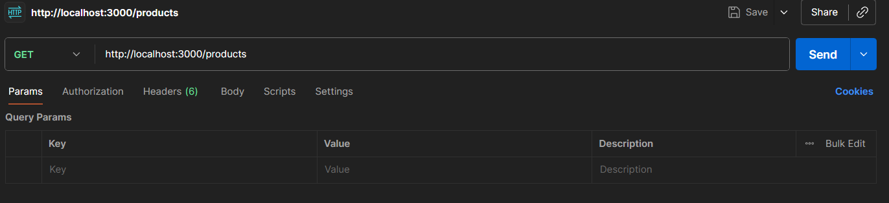
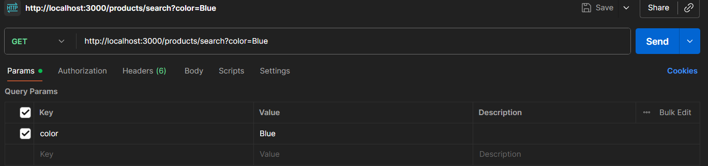
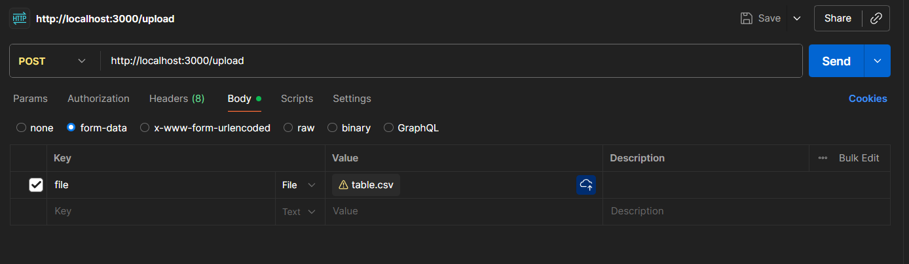

# Product Catalog Backend Service

This backend service provides a REST API to manage a product catalog. It allows for **uploading a CSV file**, **validating its contents**, **storing valid products** in a PostgreSQL database, and **retrieving/searching** the stored products.

---

## Features

* **CSV Upload:** Upload a product catalog in CSV format.
* **Data Validation:** Each row is validated for:
  - Required fields: `sku`, `name`, `brand`, `mrp`, `price`.
  - Business rules: `price <= mrp`, `quantity >= 0`.
* **Database Storage:** Valid products are stored in PostgreSQL. Existing products (by SKU) are automatically updated.
* **List API:** Retrieve all stored products with pagination support.
* **Search API:** Filter products by `brand`, `color`, and price range (`minPrice`, `maxPrice`).

---

## Tech Stack

* Node.js
* Express.js
* PostgreSQL
* ES Modules
* [`multer`](https://www.npmjs.com/package/multer) (for file uploads)
* [`csv-parser`](https://www.npmjs.com/package/csv-parser) (for CSV streaming)
* [`pg`](https://www.npmjs.com/package/pg) and [`pg-format`](https://www.npmjs.com/package/pg-format) (PostgreSQL driver and query formatting)

---

## Project Structure

```text
project_catalog_api/
│
├─ index.js                 # Entry point
├─ db.js                    # PostgreSQL connection pool
├─ routes/
│   ├─ upload.js            # Upload routes
│   ├─ products.js          # Product routes
├─ controllers/
│   ├─ uploadController.js  # CSV upload logic
│   ├─ productController.js # Product listing & search logic
├─ middleware/
│   └─ uploadMiddleware.js  # Multer configuration
├─ package.json
└─ .env
```
## Getting Started

**1.Clone the repository:**
```text
git clone <repo-url>
cd project_catalog_api
```

**2.Install dependencies:**
```bash
npm install
```

**3.Create a .env file in the root directory:**
```env
PORT=3000
PG_USER=<your_pg_user>
PG_PASSWORD=<your_pg_password>
PG_HOST=localhost
PG_PORT=5432
PG_DATABASE=<your_database_name>
```

⚠️ Make sure your PostgreSQL database is running and the products table exists.

**4.Run the server:**
```bash
npm start
```

The API will be available at http://localhost:3000.

## How to Test the APIs in Postman

### 1. Test **GET /products** (The List API)

This is the easiest one.

1. Open a new tab in **Postman**.  
2. Make sure the method (the dropdown next to the URL) is set to **GET**.  
3. In the URL bar, type:  http://localhost:3000/products

4. Click **Send**.  
5. You will see the JSON response in the bottom panel.  

---

### 2. Test **GET /products/search** (The Search API)

This is also a GET request and works just like the one above, but you'll use the **Params** tab to make it easy.

1. Open a new tab.  
2. Set the method to **GET**.  
3. In the URL bar, type:  http://localhost:3000/products/search
4. Below the URL bar, click the **Params** tab.  
5. Enter your filters here as key-value pairs. Postman will automatically add them to the URL for you.  

| KEY       | VALUE      |
|------------|------------|
| brand      | BloomWear  |
| maxPrice   | 2500       |


6. Click **Send**.  
7. You'll see the filtered results in the response panel.  

---

### 3. Test **POST /upload** (The File Upload API)

This one is different — you’ll upload a CSV file.

1. Open a new tab.  
2. Change the method (the dropdown) to **POST**.  
3. In the URL bar, type:  http://localhost:3000/upload
4. Go to the **Body** tab (below the URL bar).  
5. Select the option labeled **form-data**.  
6. A table of key-value pairs will appear. This is where you'll attach your file.  
7. In the **KEY** column, type **file** (this **must** be `"file"` because your Node.js code uses `upload.single('file')`).  
8. Click the small dropdown on the right side of the **KEY** box (it defaults to *Text*) and change it to **File**.  
9. In the **VALUE** column, a **Select Files** button will appear. Click it and choose your `table.csv` file from your computer.  

10. Once the key and file are set, click **Send**.  

Your CSV file will be uploaded and processed by the API.

## 🚀 Conclusion

This project demonstrates how to design a clean, modular Node.js backend for real-world product management.  
Feel free to fork, modify, and extend it with your own features — such as authentication, analytics, or frontend dashboards.  
